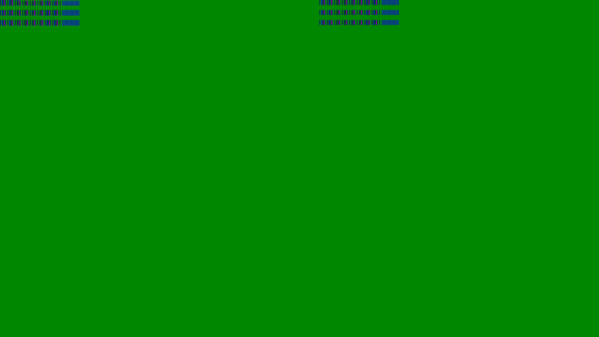

# appendRustImages

We can place one image upon another with the help of this program

* smallest image dimensions will be considered for output however though as of now

> compile

-- need rust pre-installed

cargo build --release

or to install 

`cargo install` (in root directory of project)

> syntax:

`combiner <image1 path> <image2 path> <output image path>`

# +

# =

